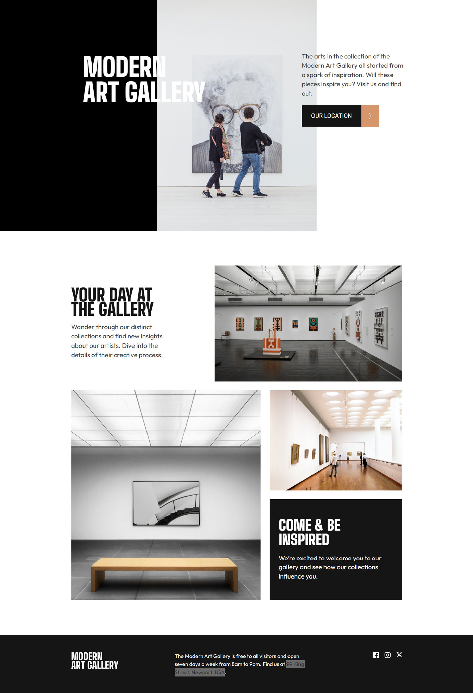
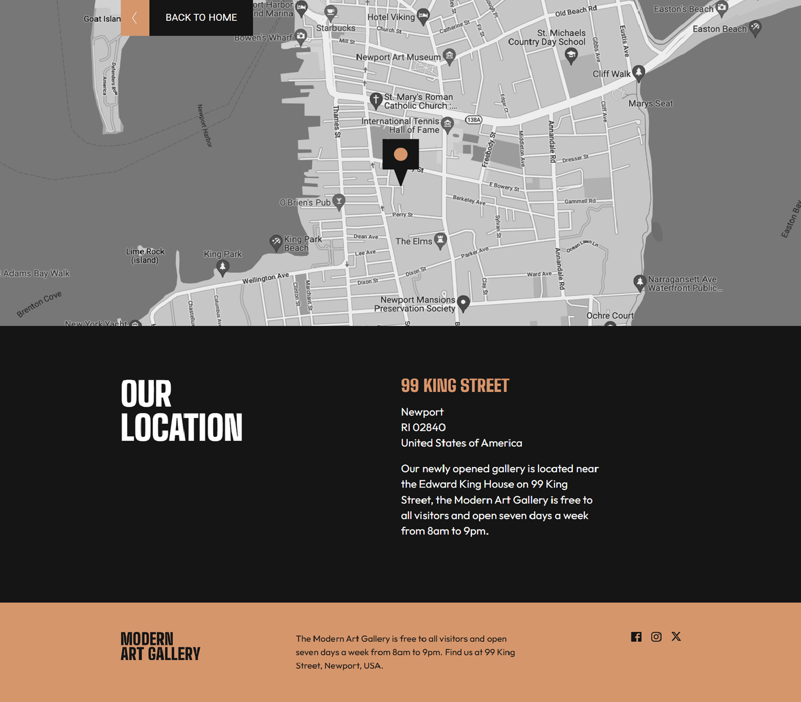

# 🎨 Modern Art Gallery Microsite

Responsive microsite for a modern art gallery, built with a mobile-first approach and modern CSS architecture.

---

## 🌍 Live Demo

👉 https://cryptolomeo.github.io/Modern-Art-Gallery--Microsite/

---

## 📸 Preview
### - Principal


### - Location



---

## 🚀 Technologies

* HTML5
* SCSS (Sass)
* CSS Grid & Flexbox
* Vite (build tool)
* Responsive Design (mobile-first approach)

---

## 📂 Project Structure

```bash
project/
├── index.html
├── location.html
├── css/
├── scss/
├── img/
├── vite.config.js
```

---

## 🧱 Architecture

This project follows the 7-1 Sass architecture pattern, a scalable and maintainable structure popularized by Kitty Giraudel.

```bash
scss/
├── abstracts/   # variables, mixins, functions
├── base/        # reset, typography
├── components/  # buttons, cards, UI elements
├── layout/      # header, footer, grid
├── pages/       # page-specific styles
├── themes/      # themes (if any)
├── vendors/     # external styles
└── main.scss    # main entry point
```

---

## 📱 Features

* Fully responsive design (mobile, tablet, desktop)
* Dynamic image switching per breakpoint
* CSS Grid layout for desktop views
* Reusable SCSS mixins using Sass maps
* Semantic HTML structure
* Clean component-based styling

---

## 🧠 What I Learned

* Structuring scalable styles using the 7-1 Sass architecture
* Implemented Sass maps for breakpoint management and built reusable mixins for responsive design.
* Managing complex responsive layouts
* Separating layout and component logic for better scalability
* Advanced positioning techniques
* Improved understanding of CSS Grid and Flexbox layouts
* Learned to structure multi-page projects with Vite

---

## ⚙️ Installation

```bash
git clone https://github.com/cryptolomeo/Modern-Art-Gallery--Microsite.git
cd Modern-Art-Gallery--Microsite
npm install
npm run dev
```

---

## 🚀 Deployment

Deployed using GitHub Pages with Vite build configuration:

```bash
npm run build
npm run deploy
```

---

## ✨ Author

Iván Rodríguez da Mota — **TaliantCode**
Frontend Developer in progress 🚀
